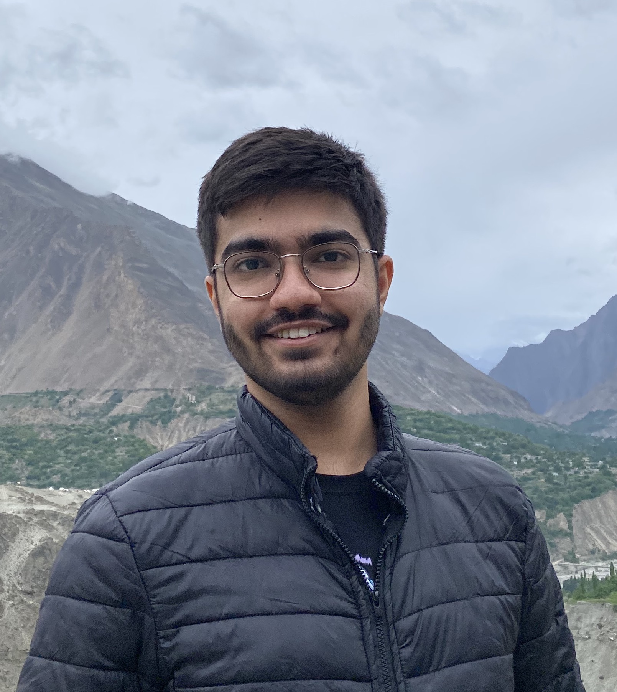

## About Me

Hi! I'm Haseeb, a student, computer scientist and researcher. I have completed my undergradute in Computer Science from the **Lahore University of Management Sciences** [(LUMS)](https://lums.edu.pk/programmes/bs-computer-science) where I was advised by [Dr. Zafar Ayyub Qazi](https://web.lums.edu.pk/~zafar/) and [Dr. Ihsan Ayyub Qazi](https://www.ihsanqazi.com/). This <strong>Fall</strong> (2023), I will be moving to the [University of Waterloo](https://uwaterloo.ca/graduate-studies-postdoctoral-affairs/future-students/programs/computer-science-mmath-waterloo) to begin my Masters of Mathematics (MMath) in Computer Science! 

Besides studying and academic research, I have also worked as a backend software engineer at [Tajir](https://www.tajir.app/sellers), Pakistans first Y-Combinator backed startup! 

Personally, I'm an avid gamer (The civilization series is my favourite) and love to go on hikes! I also enjoy travelling and try my best to make time for it (That's me in Hunza, Gilgit Baltistan!).

## Research Interest

At LUMS, I have primarily worked on <strong>Web Affordability</strong>. I initiated worked on the affordability of advertisement videos on YouTube in developed and developing countries. I tried to answer the question: <strong> If I buy 2GB of mobile data, how much of that is used (wasted) towards ad videos? </strong> Besides this, I have also worked on developing techniques to capture page size reductions on various mobile apps such as Opera and Brave. This helped us with analysis in our recently published work (SIGCOMM 2023).

## Publications

1. [SIGCOMM ‘23] A Framework for Improving Web Affordability and Inclusiveness (Rumaisa Habib*, Sarah Tanveer*, Aimen Inam, <strong>Haseeb Ahmed</strong>, Ayesha Ali, Zartash Afzal Uzmi, Zafar Ayyub Qazi, Ihsan Ayyub Qazi) [*Joint first authors]

## Professional Experience

Year | Role | Organisation | Responsibilities
-----|------|--------------|-----------------
2022 - 2023 | Software Engineer  | Tajir | At Tajir, I worked as a backend engineer, specializing in Python, Kotlin, Flask and PostgreSQL. I also worked on platforms such as retool (internal dashboards and integrations) as well as Google Cloud Platform (GCP).    Key Responsibilites:    • Designing, developing and deploying robust customer facing and internal features. This includes new user features in the android application or internal dashboards. I was able to ship my first product for internal use within the first month.    • Integration of various third-party applications (such as Zendesk) into our database systems for information retrieval and syncing. I worked extensively with retool and retool workflows to achieve such integrations that were scalable and maintainable.  

## Teaching Experience

* Teaching Assistant (LUMS):
    * **CS-678**: Topics in Internet Research:
    Responsible for assisting students with research papers and their research projects. Held weekly meetings that involved discussing the various strategies and roadblocks projects groups faced. Grading components including class participation and paper summaries.

    * **CS-535**: Machine Learning: Assisted students with understand complex mathematical concepts. Developed programming assignment on linear regression. Assisted in making quizzes and homeworks. 

    * **CS-200**: Introduction to Programming: Assisted students in their weekly 4-hour lab. Created different labs and assignments for the students. Course was taught in C++.

* IEEE LUMS chapter: 
    * Convener CodingGuru 3.0: As convener my responsibilities encompass designing competition modules, picking strong event heads and technical teams. I also assisted them on creating competition questions. The event was attended by over 60 participants from across all over Pakistan. 

## Educational Background

Period | Degree | Instituion | Country 
-----|------|--------------|----------
September 2023 - Present| Master of Mathematics in Computer Science (MMath): thesis-based| David R. Cheriton School of Computer Science, University of Waterloo| 
August 2019 - May 2023| Bachelors of Science (BS) Computer Science | Lahore University of Management Sciences (LUMS) | 

## Achievements

* Was awareded the International Master's Award of Excellence (IMAE) scholarship at the University of Waterloo.

* Graduated from my undergraduate with distinction! 

* Placed on Deans honour list for Fall & Spring 2020-2021, Spring 2021

## Technical Skills

* **Programming Languages**: C, C++, Python, Go, Haskell, Javascript, Kotlin and R
* **App/Web Development**: MongoDB, PostgreSQL, SQL, React, Flask, Android 
* **Miscellaneous**: Docker, Google Cloud Platform, Selenium, Bash, Pandas 

#### Credits: 
<ul>
<small>
<li><a href='https://github.com/ankitsultana/researcher/'>Ankit</a> for the theme. </li>
<li><a href='https://tejasvi.dev/'>Tejasvi</a> for the theme. </li>
<li><a href='https://www.flaticon.com/'>Flaticon</a> for the theme. </li>
</small>
</ul>
